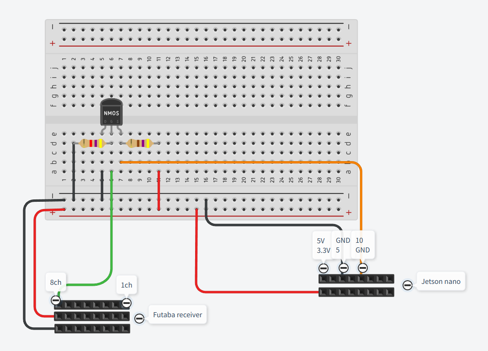

# sbus_ros2
I ported [sbus_serial](https://github.com/jenswilly/sbus_serial) to ROS2.

## Build
```bash
colcon build --symlink-install
```

## Launch the node
```bash
ros2 launch sbus_bridge sbus_bridge_node_launch.py
```

## Config
See `src/sbus_bridge/config/params.yaml`

## Use this on the Jetson Nano

1. Add a permission to connect an UART port.
```bash
sudo gpasswd --add ${USER} dialout
sudo chmod 666 /dev/ttyTHS1
```

2. Make sure the receiver outputs the S.bus signal.
3. You can check the raw output:
```bash
./install/sbus_bridge/lib/sbus_bridge/sbus_calib /dev/ttyTHS1
```
`/dev/ttyTHS1` should be set as the available UART port.

## Schematics
